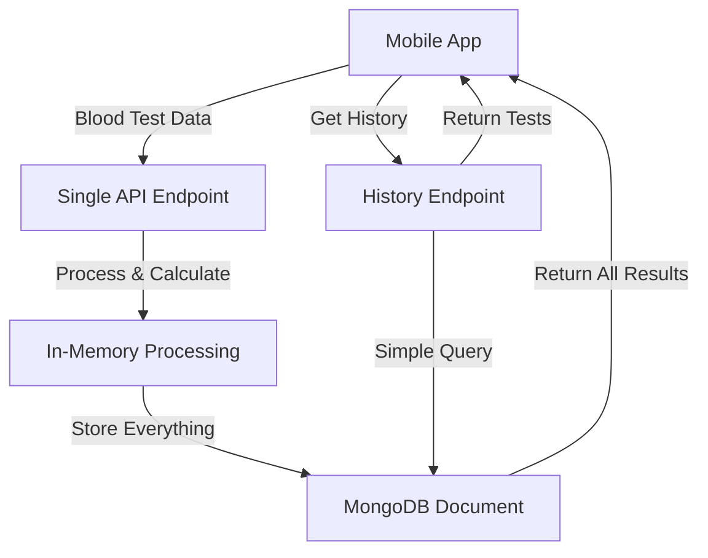
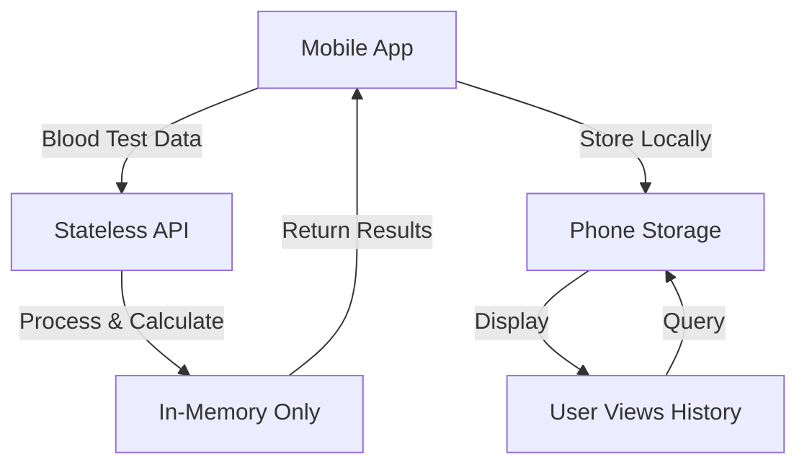

# Vitals API Architecture - Lightweight Serverless Biomarker Processing

## Overview

A simple serverless API system designed for low-frequency biomarker processing (1-2 blood tests per user per year). The architecture prioritizes simplicity and cost-effectiveness over high-throughput optimization.

## Key Design Considerations

Given the low usage frequency:

- **No caching needed** - With 1-2 requests per user per year, caching adds unnecessary complexity
- **Simple database queries** - No need for complex indexing or query optimization
- **Minimal infrastructure** - Single Cloud Run service with combined endpoints
- **On-demand processing** - Calculate algorithms in real-time rather than pre-computing
- **Pay-per-use model** - Serverless scales to zero between requests

## Simplified Architecture

### Single Service Design

**One Cloud Run Service: `vitals-api`**

Combines all functionality into a single lightweight service with three main endpoints:

#### 1. Process & Store Endpoint

**`POST /api/v1/biomarkers`**

- Receives raw biomarker JSON from mobile app
- Performs unit conversions in-memory
- Calculates all applicable algorithms immediately
- Stores both raw data and results in one MongoDB document
- Returns all results in a single response

#### 2. Retrieve Historical Data Endpoint

**`GET /api/v1/biomarkers/{patient_id}`**

- Simple query to fetch user's historical test results
- Returns maximum 10-20 documents (given 1-2 tests/year)
- No pagination needed due to low data volume

#### 3. Health Check Endpoint

**`GET /api/v1/health`**

- Simple endpoint for monitoring service availability

## Simplified Data Flow



## MongoDB Schema - Single Collection

### Collection: `blood_tests`

```javascript
{
  _id: ObjectId,
  patient_id: String,
  test_date: Date,
  created_at: Date,

  // Original data from mobile app
  raw_data: {
    metadata: { /* as received */ },
    raw_biomarkers: { /* as received */ },
    clinical_data: { /* as received */ }
  },

  // Processed biomarkers with unit conversions
  processed_biomarkers: {
    albumin_g_dl: { value: Number, unit: String },
    albumin_g_l: { value: Number, unit: String },
    // ... other biomarkers with conversions
  },

  // Algorithm results (only populated if requirements met)
  results: {
    phenoage: {
      calculated: Boolean,
      phenoage: Number,
      mortality_score: Number,
      missing_markers: [String]  // If not calculated
    },
    score2: {
      calculated: Boolean,
      risk_percentage: Number,
      risk_category: String,
      missing_data: [String]  // If not calculated
    },
    score2_diabetes: {
      calculated: Boolean,
      risk_percentage: Number,
      risk_category: String,
      missing_data: [String]  // If not calculated
    }
  }
}
```

## Implementation Approach

### Single Python Service

```python
# main.py structure
from fastapi import FastAPI
from vitals.biomarkers.helpers import process_biomarkers
from vitals.models import phenoage, score2, score2_diabetes

app = FastAPI()

@app.post("/api/v1/biomarkers")
async def process_blood_test(data: dict):
    # 1. Process biomarkers (unit conversions)
    processed = process_biomarkers(data)

    # 2. Try each algorithm
    results = {
        "phenoage": try_phenoage(processed),
        "score2": try_score2(processed),
        "score2_diabetes": try_score2_diabetes(processed)
    }

    # 3. Store everything in one document
    doc = {
        "patient_id": data["metadata"]["patient_id"],
        "test_date": data["metadata"]["test_date"],
        "raw_data": data,
        "processed_biomarkers": processed,
        "results": results
    }

    # 4. Save to MongoDB and return
    db.blood_tests.insert_one(doc)
    return {"success": True, "results": results}
```

## Deployment Configuration

### Minimal Cloud Run Setup

```yaml
# Single service configuration
apiVersion: serving.knative.dev/v1
kind: Service
metadata:
  name: vitals-api
spec:
  template:
    metadata:
      annotations:
        run.googleapis.com/execution-environment: gen2
    spec:
      containers:
      - image: gcr.io/project-id/vitals-api:latest
        resources:
          limits:
            cpu: "1"
            memory: "512Mi"
        env:
        - name: MONGODB_URI
          value: "mongodb+srv://..."
      serviceAccountName: vitals-api-sa
  traffic:
  - percent: 100
    latestRevision: true
```

### Cost Optimization

With 1-2 requests per user per year:

- **Cloud Run**: ~$0 (scales to zero, minimal invocations)
- **MongoDB Atlas**: M0 (free tier) or M2 (~$9/month) sufficient for thousands of users
- **No API Gateway needed**: Direct Cloud Run URL with built-in authentication
- **No caching layer**: Unnecessary for this frequency
- **No message queues**: Synchronous processing is fine

## Security - Simple Approach

1. **API Key Authentication**: Simple header-based API key
2. **HTTPS Only**: Cloud Run provides this by default
3. **Basic Rate Limiting**: Cloud Run's built-in quotas sufficient
4. **Input Validation**: Pydantic models for request validation

## Monitoring - Lightweight

1. **Cloud Run Metrics**: Default metrics sufficient
2. **Error Logging**: Python logging to Cloud Logging
3. **Uptime Monitoring**: Simple health check every 5 minutes
4. **No complex dashboards needed** for this usage pattern

## Development Phases - Simplified

### Phase 1: MVP (1-2 weeks)

- Single FastAPI service
- MongoDB connection
- All three algorithms integrated
- Basic error handling

### Phase 2: Production Ready (1 week)

- Add authentication
- Deploy to Cloud Run
- Connect MongoDB Atlas
- Basic monitoring

### Phase 3: Mobile Integration (1 week)

- API documentation
- Mobile SDK/examples
- End-to-end testing

## Example API Usage

### Submit Blood Test

```bash
curl -X POST https://vitals-api-xxx.run.app/api/v1/biomarkers \
  -H "X-API-Key: your-api-key" \
  -H "Content-Type: application/json" \
  -d @blood_test.json
```

Response includes all calculated results immediately.

### Get History

```bash
curl https://vitals-api-xxx.run.app/api/v1/biomarkers/P001-2024-001 \
  -H "X-API-Key: your-api-key"
```

Returns array of 1-2 test results per year.

## Why This Architecture?

1. **Simplicity**: One service, one database collection, straightforward logic
2. **Cost-effective**: Minimal resources for low-frequency usage
3. **Fast implementation**: Can be built in 2-3 weeks
4. **Easy maintenance**: Less moving parts = less to break
5. **Appropriate scale**: Designed for actual usage pattern, not hypothetical scale

## Next Steps

1. Create simple FastAPI service
2. Set up MongoDB Atlas free tier
3. Deploy to Cloud Run
4. Test with mobile app
5. Monitor actual usage patterns and adjust if needed

---

# Alternative Architecture: Stateless API with Local Phone Storage

## Overview

A privacy-first, stateless architecture where all personal health data remains on the user's device. The API serves purely as a computation service without storing any user data, eliminating GDPR compliance requirements and giving users complete ownership of their health information.

## Why Consider This Approach?

Given that users only perform 1-2 blood tests per year, storing data locally on the phone is highly practical:

- **Complete Privacy**: Health data never leaves the user's control
- **Zero Compliance Burden**: No GDPR, HIPAA, or other regulatory requirements
- **No Storage Costs**: Eliminate database infrastructure entirely
- **User Data Ownership**: Users have full control over their health records
- **No Data Breach Risk**: Can't leak data you don't store

## Stateless Architecture Design

### Single Compute Endpoint

**`POST /api/v1/analyze`**

- **Purpose**: Process biomarkers and calculate all applicable algorithms
- **Input**: Raw biomarker data (no user identification needed)
- **Processing**: Unit conversions + algorithm calculations
- **Output**: Processed data + all algorithm results
- **Storage**: None - completely stateless

### Stateless Data Flow



## API Request/Response Format

### Request Structure

```json
{
  "biomarkers": {
    "albumin": { "value": 4.05, "unit": "g/dL" },
    "creatinine": { "value": 1.17, "unit": "mg/dL" },
    "glucose": { "value": 70.5, "unit": "mg/dL" },
    // ... other biomarkers
  },
  "clinical_data": {
    "age": 45,
    "sex": "female",
    "smoking": false,
    "systolic_bp": 120
    // ... other clinical data
  }
}
```

### Response Structure

```json
{
  "processed_biomarkers": {
    "albumin_g_dl": { "value": 4.05, "unit": "g/dL" },
    "albumin_g_l": { "value": 40.5, "unit": "g/L" },
    // ... all conversions
  },
  "algorithms": {
    "phenoage": {
      "available": true,
      "results": {
        "phenoage": 42.3,
        "mortality_score": 0.023
      }
    },
    "score2": {
      "available": false,
      "missing_requirements": ["hdl_cholesterol", "total_cholesterol"]
    },
    "score2_diabetes": {
      "available": false,
      "missing_requirements": ["diabetes_status", "hba1c"]
    }
  },
  "processing_timestamp": "2024-01-15T10:30:00Z"
}
```

## Implementation - Pure Functions

```python
from fastapi import FastAPI
from vitals.biomarkers.helpers import convert_units
from vitals.models import phenoage, score2, score2_diabetes

app = FastAPI()

@app.post("/api/v1/analyze")
async def analyze_biomarkers(data: dict):
    # Pure function - no side effects, no storage

    # 1. Convert units
    processed = convert_units(data["biomarkers"])

    # 2. Check algorithm requirements and calculate
    results = {}

    # Try PhenoAge
    phenoage_markers = extract_phenoage_markers(processed, data["clinical_data"])
    if phenoage_markers:
        results["phenoage"] = {
            "available": True,
            "results": phenoage.calculate(phenoage_markers)
        }
    else:
        results["phenoage"] = {
            "available": False,
            "missing_requirements": get_missing_phenoage_markers(processed)
        }

    # Similar for SCORE2 and SCORE2-Diabetes...

    return {
        "processed_biomarkers": processed,
        "algorithms": results,
        "processing_timestamp": datetime.utcnow().isoformat()
    }

# No database connections, no user management, no sessions
```

## Mobile App Storage Strategy

The mobile app handles all data persistence:

```javascript
// Example mobile storage schema
{
  "blood_tests": [
    {
      "id": "local-uuid",
      "date": "2024-01-15",
      "raw_input": { /* original data */ },
      "api_response": { /* full API response */ },
      "notes": "Annual checkup"
    }
  ],
  "user_profile": {
    "name": "John Doe",
    "date_of_birth": "1980-01-01"
  }
}
```

## Deployment - Even Simpler

```yaml
apiVersion: serving.knative.dev/v1
kind: Service
metadata:
  name: vitals-compute-api
spec:
  template:
    spec:
      containers:
      - image: gcr.io/project-id/vitals-compute:latest
        resources:
          limits:
            cpu: "1"
            memory: "256Mi"  # Even less memory needed
        env:
        - name: LOG_LEVEL
          value: "info"
        # No database connection strings needed!
```

## Architecture Comparison

| Aspect | Server Storage (Option 1) | Local Storage (Option 2) |
|--------|--------------------------|-------------------------|
| **Monthly Cost** | $9-55 (DB + hosting) | ~$0 (hosting only) |
| **GDPR Compliance** | Required | Not applicable |
| **Data Breach Risk** | Possible | None |
| **Implementation Time** | 2-3 weeks | 3-5 days |
| **User Privacy** | Good | Excellent |
| **Offline Access** | No | Yes |
| **Cross-Device Sync** | Automatic | Manual (user exports) |
| **Historical Queries** | Server-side | Client-side only |

## Trade-offs to Consider

### Advantages of Local Storage

- **Maximum privacy and user control**
- **Zero compliance overhead**
- **Minimal infrastructure costs**
- **Works offline**
- **No user accounts needed**

### Disadvantages

- **No automatic cross-device sync** (users must export/import)
- **Data loss if phone lost** (unless user backs up)
- **No server-side analytics** (aggregate health trends)
- **Mobile app must handle data management**

## Security Considerations

1. **API Security**:
   - Rate limiting to prevent abuse
   - Input validation only
   - No authentication needed (no user data)

2. **Mobile Security**:
   - Encrypted local storage
   - Biometric protection for app
   - Optional cloud backup (user's choice)

## Which Architecture to Choose?

**Choose Server Storage (Option 1) if:**

- You need cross-device synchronization
- You want to provide population health insights
- Users expect automatic backups
- You're willing to handle compliance

**Choose Local Storage (Option 2) if:**

- Privacy is the top priority
- You want zero compliance burden
- You prefer minimal infrastructure
- Users are comfortable managing their own data

## Implementation Timeline - Stateless Option

### Phase 1: API Development (2-3 days)

- Create stateless FastAPI service
- Integrate algorithm calculations
- Deploy to Cloud Run

### Phase 2: Mobile Integration (3-5 days)

- Implement local storage
- Create data export/import
- Add backup reminders

### Total: Less than 1 week to production

## Conclusion

For an app with 1-2 blood tests per user per year, the stateless architecture with local storage offers compelling advantages in terms of privacy, cost, and simplicity. The trade-off of manual data management is minimal given the low frequency of use, while the benefits of zero compliance burden and complete user data ownership are substantial.
